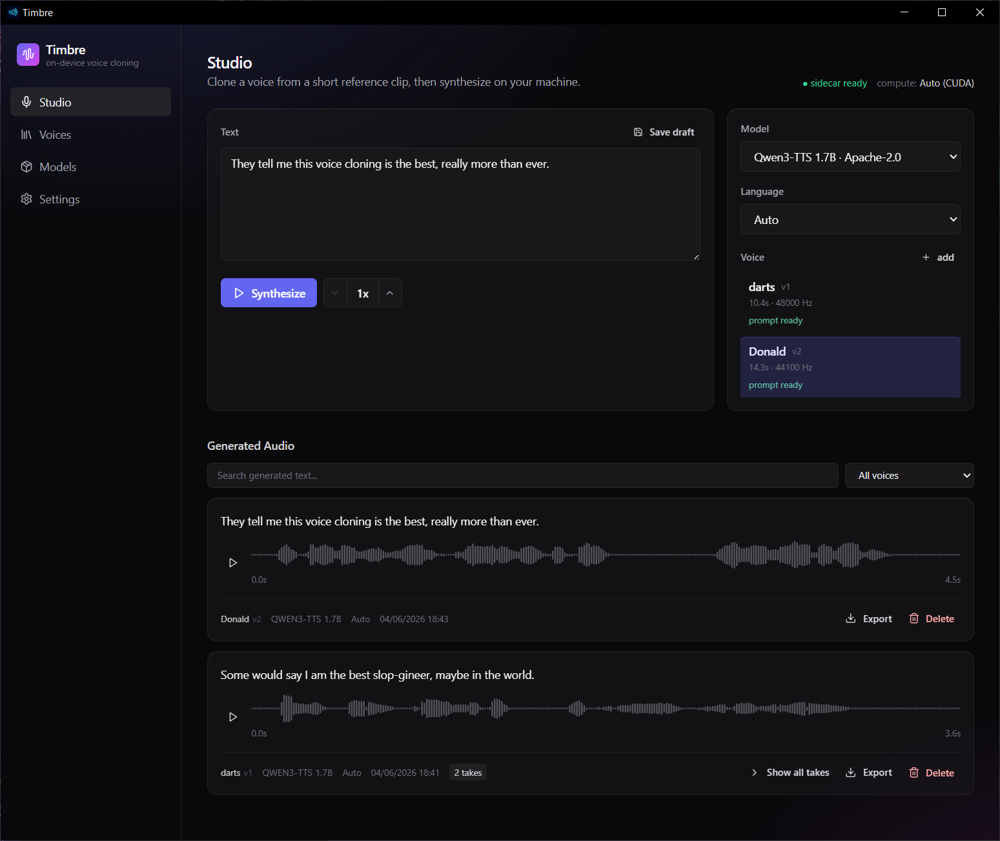
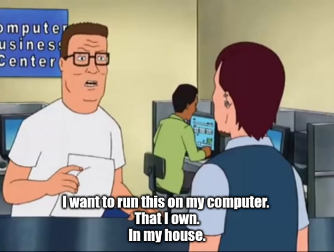

# timbre
Voice cloning with open models on your machine.

## How to

### Install

1. Download the latest release binary for your system.
1. Install it. You'll need to ignore warnings about it being unsigned.
1. Pick your backend. The application will try to detect your GPU.

### Get started

1. Go to the `Models` tab and download one. I recommend `Qwen3-TTS 1.7B` but feel free to try out the others.
1. Go to the `Voices` tab. Options:
    1. Create a voice.
        1. Record your voice with your microphone.
        1. Pick an existing audio clip. You can add the transcript yourself or use the "Generate" button to let AI do it for you (locally of course).
    1. Import a voice that you (or someone else) created.
1. Go to the `Studio` tab.
    1. Enter some text.
    1. Pick your model. 
    1. Pick your voice.
    1. Press `Synthesize`.
1. Listen to your newely generated audio.

That's pretty much it. No faffing with dependencies. Through the magic of _The Binary_ you can run these models on most laptops. It will probably even work!

The software isn't entirely reliable and does occasionally require some patience. But hey, if it were good, I'd be able to sell it.

Windows, Linux and MacOS binaries are available with Nvidia/AMD GPU, AMD GPU acceleration and Neural Engine respectively.  
From testing: an RTX3070 vastly outperforms an M2 Pro chip. I suppose the order of magnitude difference in power consumption is related to this discovery.  
Tests with an 9070XT were functional but the performance wasn't great. CPU generation might be faster in this case.

## Why?

### It's a fun idea

I enjoyed playing around with qwentts but it was a bit clunky. I can send my friends voice clips of Daffy Duck saying he would really appreciate if their aim was better, but they can't send any back. 

### To learn

I wanted an exercise for myself to try and build a project from the ground up with only :sparkles: vibes :sparkles: and a credit card (AI). I don't think I will take this approach again, certainly not this hands-off.

### Some feelings

Claude Opus 4.7 is comparable to a very eager and surprisingly competetent junior developer who will absolutely destroy your codebase if left unchecked.  
I had more success keeping GPT-5.5 on-task and was akin to Opus 4.7, had it been given its prescribed dose of pharmaceutical-grade amphetamines.  
Having a relatively low-effort method of creating apps like this is pretty cool imo. Although this does border on the definition of slop; low effort, low quality software which provides little benefit to anyone (except, perhaps John Shareholder).

### I have opinions

I don't like the idea of a future where everything is a subscription. Granted, there is some irony that I used a subscription-only service running on GPUs in the cloud (someone else's computer) to do this. However, like most people, hypocrisy is fine when I do it because this is a special case.  
But even a small win, is a win.  

## Disclaimer

You are entirely responsible for your actions using this software. Do not clone the voices of real people without their permission. No one "accidentally" uses a cloned voice to commit fraud or impersonate a public figure.  

## License & attribution

Timbre is licensed under the [MIT License](LICENSE).

Third-party components — the four TTS models, PyTorch, the Tauri/React stack, the bundled Python runtime, and GPU runtimes — are attributed in [THIRD_PARTY_LICENSES.md](THIRD_PARTY_LICENSES.md). Each downloaded model retains its upstream license; the Models route in the app links to the license URL for whichever model is selected.

